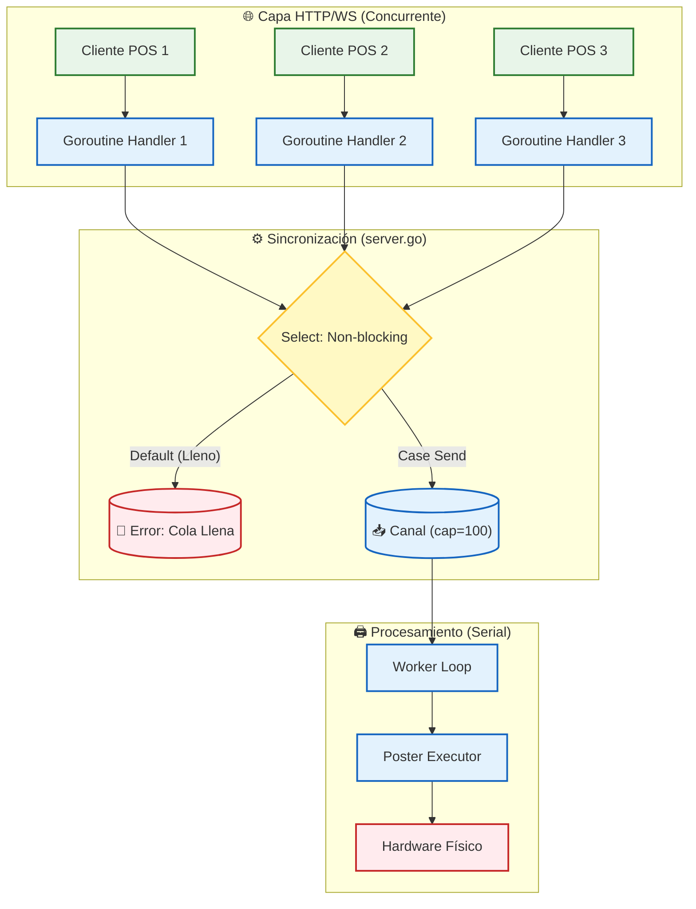
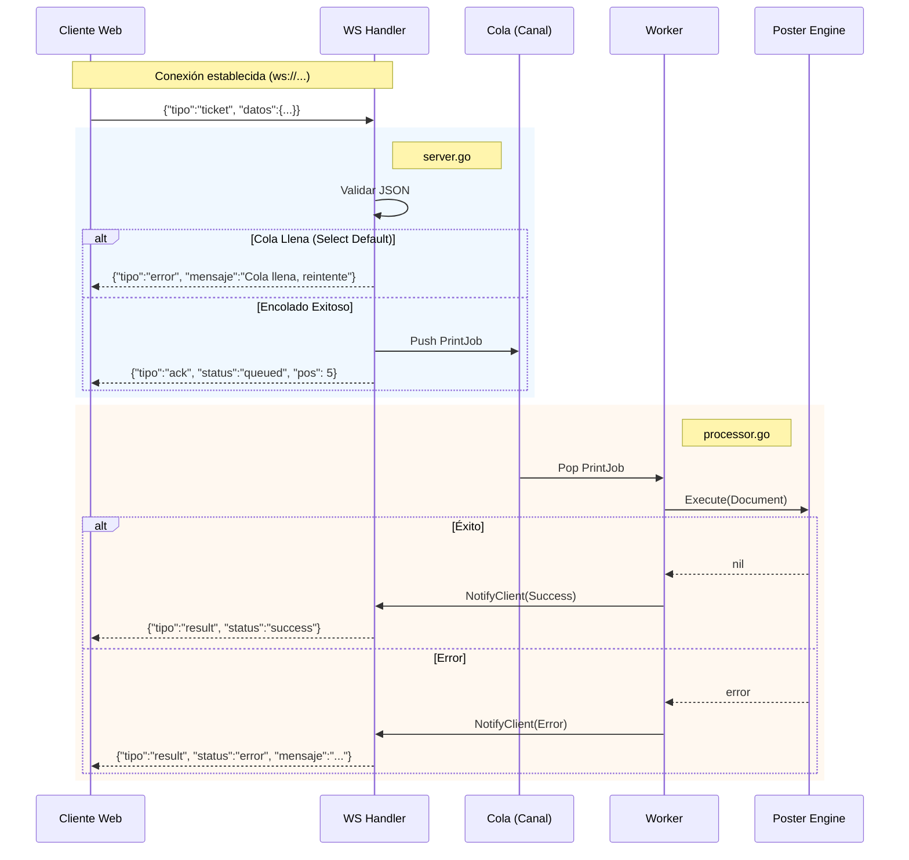

# 🎫 Ticket Daemon


**Ticket Daemon** es un Servicio de Windows diseñado para entornos de producción retail. Actúa como un middleware
robusto que conecta aplicaciones Web POS con impresoras térmicas físicas mediante WebSocket.

El servicio gestiona la concurrencia de múltiples terminales, encola trabajos para garantizar el orden de impresión y
utiliza la librería **Poster** como motor de renderizado ESC/POS.

## ✨ Características Principales

- 🔌 **Servidor WebSocket** de alto rendimiento (puerto 8766 por defecto).
- 🛡️ **Protección de Backpressure**: Cola con buffer (100 slots) y rechazo inmediato si se satura.
- 🪟 **Servicio Nativo Windows**: Integración completa con SCM (Service Control Manager).
- 📝 **Logging Estructurado**: Rotación automática de archivos (5MB) para mantenimiento cero.
- 🖨️ **Motor Poster**: Soporte avanzado para texto, códigos de barras, QR e imágenes.

---

## 🏗️ Arquitectura del Sistema

### Estructura de Componentes

El siguiente diagrama ilustra cómo el servicio envuelve los servidores HTTP/WS y coordina el flujo hacia el hardware.

```mermaid
graph TD
%% Estilos
    classDef go fill: #e1f5fe, stroke: #01579b, stroke-width: 2px, color: #000;
    classDef data fill: #fff3e0, stroke: #e65100, stroke-width: 2px, color: #000;
    classDef hw fill: #f3e5f5, stroke: #4a148c, stroke-width: 2px, color: #000;
    subgraph Host["🖥️ Host del Servicio Windows (program.go)"]
        direction TB
        Service[Wrapper del Servicio]:::go -->|Init/Start| HTTP[Servidor HTTP]:::go
        Service -->|Start/Stop| Worker[Worker de Impresión]:::go
        HTTP -->|/ws| WSServer[Handler WebSocket]:::go
    end

    subgraph Flow["🌊 Flujo de Datos"]
        direction TB
        Client[Cliente Web POS]:::data <-->|JSON Messages| WSServer
        WSServer -->|Push Job| Queue[("Canal (Buffer 100)")]:::data
        Queue -->|Pop Job| Worker
    end

    subgraph Hardware["🖨️ Integración de Hardware (processor.go)"]
        direction TB
        Worker -->|Execute| PosterLib[Librería Poster]:::hw
        PosterLib -->|Bytes ESC/POS| Spooler[Spooler de Windows]:::hw
        Spooler -->|USB/Serial/LPT| Printer[Impresora Térmica]:::hw
    end

```

### Modelo de Concurrencia (Fan-In)

El sistema utiliza un patrón de **Fan-In** con un `Select` no bloqueante. Esto permite manejar múltiples conexiones
simultáneas sin bloquear el hilo principal si la impresora es lenta.



### Ciclo de Vida del Mensaje



---

## 📡 Protocolo WebSocket

### Endpoints

| Endpoint                       | Descripción            |
|--------------------------------|------------------------|
| `ws://localhost:8766/ws`       | Conexión WebSocket     |
| `http://localhost:8766/health` | Health check (JSON)    |
| `http://localhost:8766/`       | Cliente de prueba HTML |

### Tipos de Mensaje

| Dirección | `tipo`   | Descripción                 |
|-----------|----------|-----------------------------|
| C → S     | `ticket` | Enviar trabajo de impresión |
| C → S     | `status` | Solicitar estado de la cola |
| C → S     | `ping`   | Ping al servidor            |
| S → C     | `ack`    | Trabajo aceptado y encolado |
| S → C     | `result` | Trabajo completado/fallido  |
| S → C     | `error`  | Error de validación/cola    |

### Ejemplo de Payload

```json
{
  "tipo": "ticket",
  "id": "pos1-20260109-001",
  "datos": {
    "version": "1.0",
    "profile": {
      "model": "80mm EC-PM-80250",
      "paper_width": 80
    },
    "commands": [
      {
        "type": "text",
        "data": {
          "content": {
            "text": "TICKET DE PRUEBA",
            "align": "center",
            "content_style": {
              "bold": true,
              "size": "2x2"
            }
          }
        }
      },
      {
        "type": "cut",
        "data": {
          "mode": "partial"
        }
      }
    ]
  }
}

```

---

## ⚙️ Configuración (Build-Time)

La configuración se inyecta al compilar para garantizar inmutabilidad en producción.

| Ambiente       | Flag   | Puerto           | Log Verbose | Servicio             |
|----------------|--------|------------------|-------------|----------------------|
| **Producción** | `prod` | 8766 (0.0.0.0)   | `false`     | `TicketServicio`     |
| **Test/Dev**   | `test` | 8766 (localhost) | `true`      | `TicketServicioTest` |

Para modificar los valores predeterminados, edite `internal/daemon/program.go` antes de compilar.

---

## 🚀 Inicio Rápido

### Prerrequisitos

* **Go 1.24+**
* **Task** (go-task)
* Windows 10/11 o Windows Server

### Comandos Comunes

```powershell
# 1. Compilar y ejecutar localmente (modo consola)
task run

# 2. Instalar como Servicio de Windows (Admin)
task install

# 3. Ver logs en tiempo real
task logs

# 4. Abrir dashboard de diagnóstico
task open

```

---

## 📂 Estructura del Proyecto

```
ticket-daemon/
├── cmd/
│   └── ticketd/
│       └── ticket_servicio.go    # Punto de entrada (main)
│
├── internal/
│   ├── daemon/
│   │   ├── program.go            # Wrapper svc.Service y Configuración
│   │   └── logger.go             # Logging filtrado con rotación
│   │
│   ├── server/
│   │   ├── server.go             # Lógica WebSocket y Cola (Select)
│   │   └── clients.go            # Registro Thread-Safe de clientes
│   │
│   └── worker/
│       └── processor.go          # Integración con librería Poster
│
├── web/
│   └── index.html                # Dashboard embebido (Go embed)
│
├── go.mod
├── Taskfile.yml                  # Automatización de tareas
└── README_es.md

```

---

## 📝 Logs y Auditoría

Los logs se escriben en `%PROGRAMDATA%` y rotan automáticamente.

| Ambiente | Ruta Típica                                                |
|----------|------------------------------------------------------------|
| **Prod** | `C:\ProgramData\TicketServicio\TicketServicio.log`         |
| **Test** | `C:\ProgramData\TicketServicioTest\TicketServicioTest.log` |

---

## 📄 Licencia

MIT © adcondev - RED 2000

---

## 🔗 Recursos Relacionados

* [Poster Library](https://github.com/adcondev/poster) - Motor de impresión ESC/POS
* [Especificación Documento v1.0](https://github.com/adcondev/poster/tree/master/api/v1)
