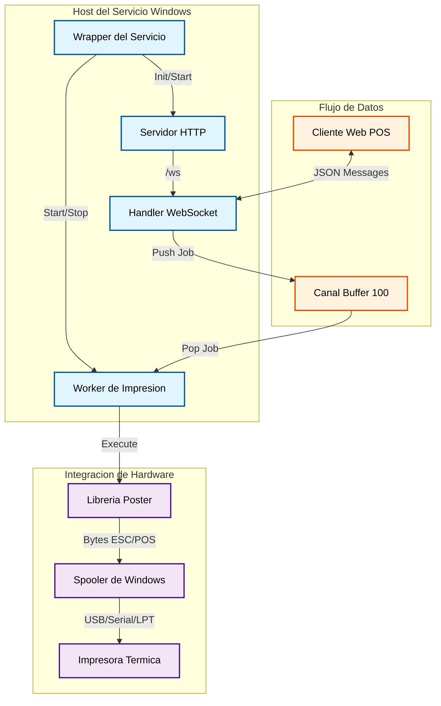
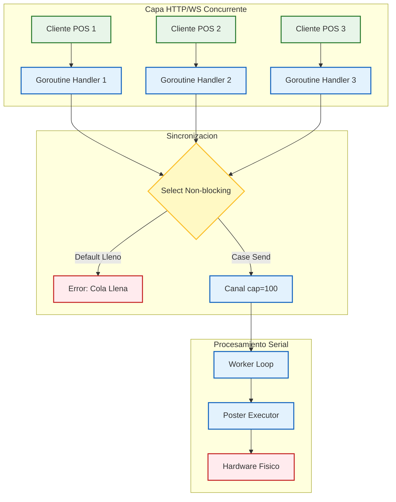
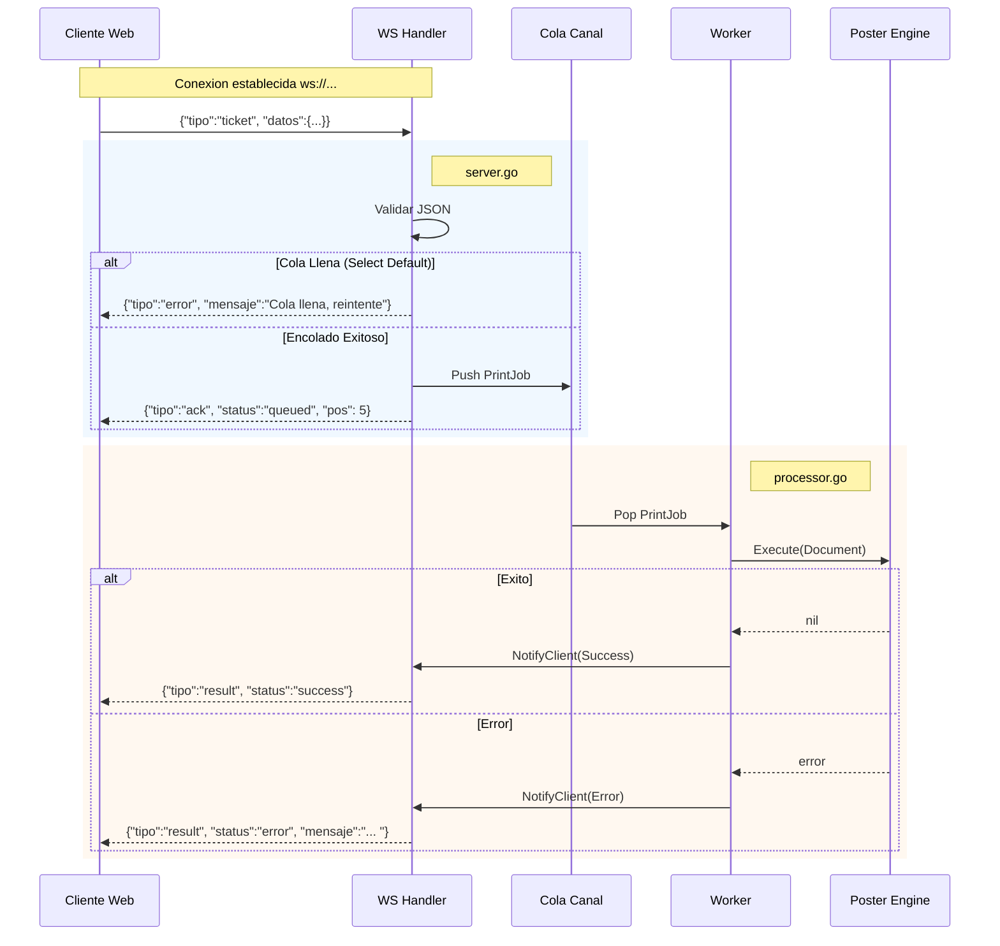

# 🎫 Ticket Daemon


**Ticket Daemon** es un Servicio de Windows diseñado para entornos de producción retail. Actúa como un middleware
robusto que conecta aplicaciones Web POS con impresoras térmicas físicas mediante WebSocket.

El servicio gestiona la concurrencia de multiples terminales, encola trabajos para garantizar el orden de impresión y
utiliza la librería **Poster** como motor de renderizado ESC/POS.

## ✨ Características Principales

- 🔌 **Servidor WebSocket** de alto rendimiento (puerto 8766 por defecto).
- 🛡️ **Protección de Backpressure**: Cola con buffer (100 slots) y rechazo inmediato si se satura.
- 🖨️ **Servicio Nativo Windows**: Integración completa con SCM (Service Control Manager).
- 📝 **Logging Estructurado**: Rotación automática de archivos (5 MB) para mantenimiento cero.
- 🖨️ **Motor Poster**: Soporte avanzado para texto, códigos de barras, QR e imágenes.
- 🔐 **Seguridad Dual**: Protección de Dashboard mediante Login, validación de Token y limitador de peticiones para
  trabajos de impresión vía API.

---

## 🏗️ Arquitectura del Sistema

### Estructura de Componentes

El siguiente diagrama ilustra como el servicio envuelve los servidores HTTP/WS y coordina el flujo hacia el hardware.



### Modelo de Concurrencia (Fan-In)

El sistema utiliza un patron de **Fan-In** con un `Select` no bloqueante. Esto permite manejar multiples conexiones
simultáneas sin bloquear el hilo principal si la impresora es lenta.



### Ciclo de Vida del Mensaje



---

## 📡 Protocolo WebSocket

### Endpoints

| Endpoint                       | Descripcion            |
|--------------------------------|------------------------|
| `ws://localhost:8766/ws`       | Conexion WebSocket     |
| `http://localhost:8766/health` | Health check (JSON)    |
| `http://localhost:8766/`       | Cliente de prueba HTML |

### Tipos de Mensaje

| Direccion | `tipo`         | Descripcion                  |
|-----------|----------------|------------------------------|
| C -> S    | `ticket`       | Enviar trabajo de impresion  |
| C -> S    | `status`       | Solicitar estado de la cola  |
| C -> S    | `ping`         | Ping al servidor             |
| C -> S    | `get_printers` | Listar impresoras instaladas |
| S -> C    | `ack`          | Trabajo aceptado y encolado  |
| S -> C    | `result`       | Trabajo completado/fallido   |
| S -> C    | `error`        | Error de validacion/cola     |
| S -> C    | `printers`     | Lista de impresoras          |

### Ejemplo de Payload

```json
{
  "tipo": "ticket",
  "id": "pos1-20260109-001",
  "datos": {
    "version": "1.0",
    "profile": {
      "model": "80mm EC-PM-80250",
      "paper_width": 80
    },
    "commands": [
      {
        "type": "text",
        "data": {
          "content": {
            "text": "TICKET DE PRUEBA",
            "align": "center",
            "content_style": {
              "bold": true,
              "size": "2x2"
            }
          }
        }
      },
      {
        "type": "cut",
        "data": {
          "mode": "partial"
        }
      }
    ]
  }
}
```

### Descubrimiento de Impresoras

El servicio detecta automáticamente las impresoras instaladas en Windows al iniciar y expone esta información via
WebSocket y HTTP.

**Mensaje WebSocket:**

Petición para obtener impresoras:

```json
{
  "tipo": "get_printers"
}
```

Respuesta del servidor:

```json
{
  "tipo": "printers",
  "status": "ok",
  "printers": [
    {
      "name": "58mm PT-210",
      "port": "USB001",
      "driver": "Generic / Text Only",
      "status": "ready",
      "is_default": true,
      "is_virtual": false,
      "printer_type": "thermal"
    }
  ],
  "summary": {
    "status": "ok",
    "detected_count": 5,
    "thermal_count": 1,
    "default_name": "58mm PT-210"
  }
}
```

**Health Check (`/health`):**

```json
{
  "status": "ok",
  "printers": {
    "status": "ok",
    "detected_count": 5,
    "thermal_count": 1,
    "default_name": "58mm PT-210"
  }
  // ... other fields
}
```

| Estado Printers | Significado                                    |
|-----------------|------------------------------------------------|
| `ok`            | Al menos una impresora térmica detectada       |
| `warning`       | Hay impresoras físicas pero ninguna es térmica |
| `error`         | No hay impresoras físicas instaladas           |

> **Nota:** El estado `ready` refleja el último estado conocido del Windows Spooler. Para impresoras USB/Serial, esto
> puede no reflejar si están físicamente conectadas en tiempo real.

---

## 🔐 Configuración de Seguridad (Build-Time)

Este servicio no usa archivos de configuración externos por seguridad. Las credenciales se inyectan al compilar:

1. **Dashboard Password:** Requiere un hash Bcrypt en base64.
2. **Auth Token:** Token simple para validar los WebSockets.

Ver `Taskfile.yml` para ejemplos de compilación.

---

## ⚙️ Configuración y Compilación

Este servicio no utiliza archivos de configuración en tiempo de ejecución (`.env` o `.yaml`) por seguridad. Las
credenciales se inyectan directamente en el binario durante la compilación.

### Variables de Build (LDFLAGS)

Las variables residen en el paquete `github.com/adcondev/ticket-daemon/internal/config`:

| Variable Go        | Descripción                                   | Ejemplo de Valor                    |
|--------------------|-----------------------------------------------|-------------------------------------|
| `AuthToken`        | Token para validar trabajos vía WebSocket     | `"mi-token-secreto"`                |
| `PasswordHashB64`  | Hash Bcrypt (base64) para acceso al Dashboard | `"Jd8a..."` (generado externamente) |
| `BuildEnvironment` | Define timeouts y comportamiento de logs      | `"local"` o `"remote"`              |

### Ejemplo de Compilación Manual

Para generar un binario seguro:

```powershell
# 1. Generar hash del password (usando herramienta auxiliar o externa)
# ...

# 2. Compilar inyectando variables
go build -ldflags "-s -w \
  -X github.com/adcondev/ticket-daemon/internal/config.AuthToken=mi-token-secreto 
  -X '[github.com/adcondev/ticket-daemon/internal/config.PasswordHashB64=HASH_BASE64_AQUI](https://github.com/adcondev/ticket-daemon/' `
  -X '[github.com/adcondev/ticket-daemon/internal/config.BuildEnvironment=local](https://github.com/adcondev/ticket-dae'" `
  -o TicketServicio.exe ./cmd/TicketServicio

```

---

## 🚀 Inicio Rápido

### Prerrequisitos

- **Go 1.24+**
- **Task** (go-task) - [Instalación](https://taskfile.dev/installation/)
- Windows 10/11 o Windows Server

### Comandos Comunes (con Task)

```powershell
# Ver todos los comandos disponibles
task

# Compilar y ejecutar en modo consola (desarrollo)
task run

# Compilar ejecutable standalone (doble-clic para ejecutar)
task build-console

# Instalar como Servicio de Windows (requiere Admin)
task install

# Ver logs en tiempo real
task logs

# Abrir dashboard de diagnostico
task open

# Verificar estado del servicio
task status
```

### Ejecutable Standalone (Sin Task)

Si prefieres distribuir solo el `.exe`:

```powershell
# 1. Compilar
task build-console

# 2. El ejecutable queda en: 
#    bin/TicketDaemon_Console.exe

# 3. Doble-clic para ejecutar, o desde terminal:
.\bin\TicketDaemon_Console.exe

# 4. Abrir navegador en: http://localhost:8766
```

---

## 📂 Estructura del Proyecto

```
ticket-daemon/
├── api/
│   └── v1/
│       ├── DOCUMENT_V1.md        # Especificacion formato documento
│       ├── WEBSOCKET_V1.md       # Especificacion protocolo WebSocket
│       ├── document.schema.json  # JSON Schema del documento
│       └── websocket.schema.json # JSON Schema mensajes WS
│
├── cmd/
│   └── TicketServicio/
│       └── ticket_servicio.go    # Punto de entrada (main)
│
├── examples/
│   └── json/                     # Ejemplos de documentos JSON
│       ├── showcase.json         # Demo de todos los comandos
│       └── table_showcase.json   # Ejemplos de tablas
│
├── internal/
│   ├── assets/
│   │   ├── embed.go              # Go embed para archivos web
│   │   └── web/                  # Dashboard HTML/CSS/JS embebido
│   │
│   ├── daemon/
│   │   ├── program.go            # Wrapper svc.Service y Configuracion
│   │   ├── logger.go             # Logging filtrado con rotacion
│   │   ├── daemon_types.go       # Tipos de respuesta Health
│   │   └── printer_discovery.go  # Descubrimiento de impresoras Windows
│   │
│   ├── printer/
│   │   └── printer_types.go      # Tipos compartidos de impresora
│   │
│   ├── server/
│   │   ├── server.go             # Logica WebSocket y Cola (Select)
│   │   └── clients.go            # Registro Thread-Safe de clientes
│   │
│   └── worker/
│       └── processor.go          # Integracion con libreria Poster
│
├── go.mod
├── Taskfile.yml                  # Automatizacion de tareas
├── README.md
└── LEARNING.md                   # Resumen tecnico para portfolio
```

---

## 📝 Logs y Auditoria

Los logs se escriben en `%PROGRAMDATA%` y rotan automáticamente al superar 5 MB.

| Ambiente     | Ruta Tipica                                                              |
|--------------|--------------------------------------------------------------------------|
| **`remote`** | `C:\ProgramData\R2k_TicketServicio_Remote\R2k_TicketServicio_Remote.log` |
| **`local`**  | `C:\ProgramData\TicketServicioTest_Local\TicketServicioTest_Local.log`   |

### Ver Logs

```powershell
# Ultimas 100 lineas
task logs

# O directamente:
Get-Content "C:\ProgramData\TicketServicioTest_Local\TicketServicioTest_Local.log" -Tail 100 -Wait
```

---

## 🔧 Solución de Problemas

### El servicio no inicia

```powershell
# Verificar estado
sc query TicketServicioTest

# Ver logs de error
task logs

# Reinstalar
task uninstall
task install
```

### No se puede conectar por WebSocket

1. Verificar que el servicio esté corriendo: `task status`
2. Verificar firewall para puerto 8766
3. Probar health check: `task health`

### La impresora no imprime

1. Verificar nombre exacto en `profile.model` (debe coincidir con Windows)
2. Verificar que Print Spooler este activo: `Get-Service Spooler`
3. Probar impresión directa desde Windows

---

## 📄 Licencia

MIT © adcondev - RED 2000

---

## 📖 Documentación de la API

Este proyecto incluye documentación detallada del protocolo y formato de documentos:

| Documento                                             | Descripción                                          |
|-------------------------------------------------------|------------------------------------------------------|
| [DOCUMENT_V1.md](api/v1/DOCUMENT_V1.md)               | Especificación del formato de documento de impresión |
| [WEBSOCKET_V1.md](api/v1/WEBSOCKET_V1.md)             | Especificación del protocolo WebSocket               |
| [document.schema.json](api/v1/document.schema.json)   | JSON Schema para validación de documentos            |
| [websocket.schema.json](api/v1/websocket.schema.json) | JSON Schema para mensajes WebSocket                  |

### Ejemplos de Uso

La carpeta `examples/json/` contiene documentos de ejemplo listos para usar:

- `showcase.json` - Demostración de todos los tipos de comandos
- `table_showcase.json` - Ejemplos de tablas con diferentes configuraciones
- `ticket_service_test.json` - Ticket completo con impuestos y QR

---

## 🔗 Recursos Relacionados

- [Poster Library](https://github.com/adcondev/poster) - Motor de impresión ESC/POS
- [Task - Automatización](https://taskfile.dev/)
