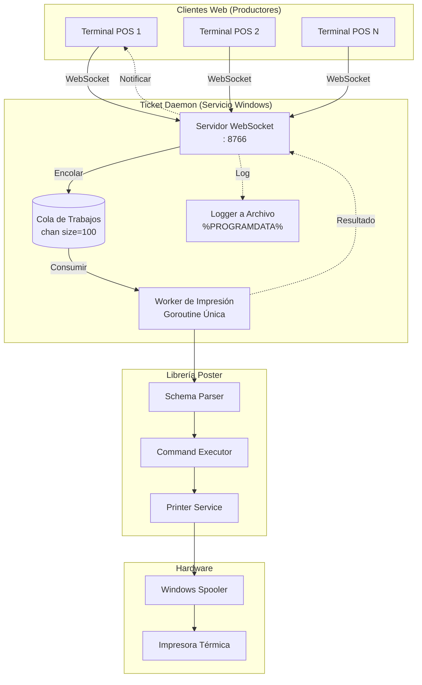
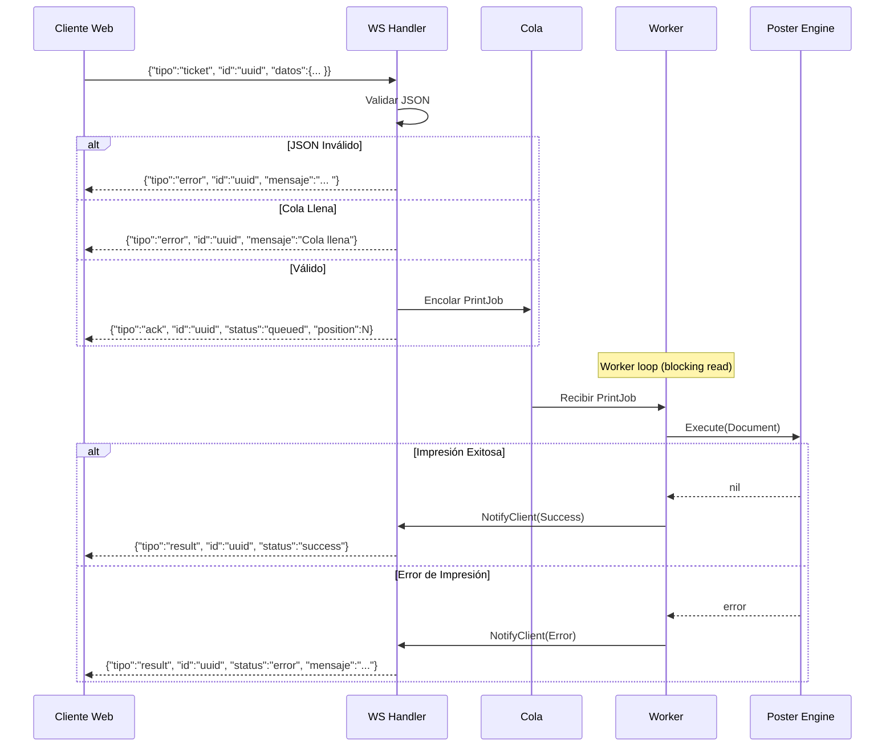
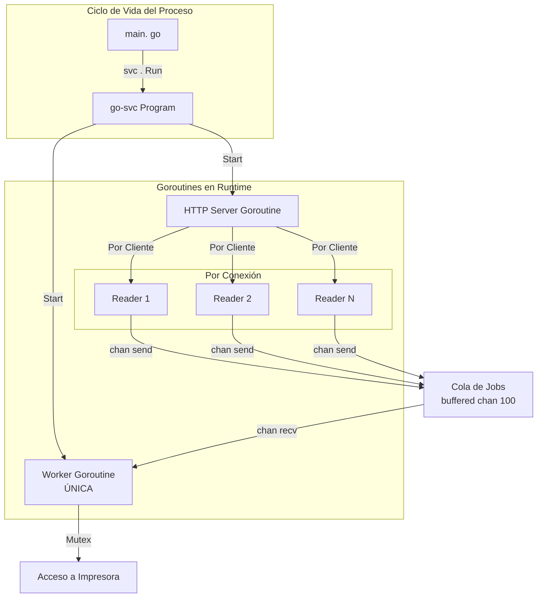

# 🎫 Ticket Daemon

**Ticket Daemon** es un Servicio de Windows que actúa como puente entre aplicaciones Web POS y impresoras térmicas
físicas. Recibe documentos JSON via WebSocket, los encola para ejecución serial, y los procesa usando la librería *
*Poster** como motor de renderizado.

## ✨ Características

- 🔌 **Servidor WebSocket** en puerto 8766
- 📦 **Cola de Trabajos** con buffer de 100 slots para tráfico en ráfagas
- 🪟 **Servicio de Windows** integración nativa via `go-svc`
- 📝 **Logging a Archivo** con rotación automática
- 🖨️ **Integración Poster** para impresión ESC/POS

---

## 🏗️ Arquitectura

### Diagrama del Sistema



### Ciclo de Vida del Mensaje



### Modelo de Goroutines



---

## 📡 Protocolo WebSocket

### Endpoints

| Endpoint                       | Descripción            |
|--------------------------------|------------------------|
| `ws://localhost:8766/ws`       | Conexión WebSocket     |
| `http://localhost:8766/health` | Health check (JSON)    |
| `http://localhost:8766/`       | Cliente de prueba HTML |

### Tipos de Mensaje

| Dirección | `tipo`   | Descripción                 |
|-----------|----------|-----------------------------|
| C → S     | `ticket` | Enviar trabajo de impresión |
| C → S     | `status` | Solicitar estado de la cola |
| C → S     | `ping`   | Ping al servidor            |
| S → C     | `ack`    | Trabajo aceptado y encolado |
| S → C     | `result` | Trabajo completado/fallido  |
| S → C     | `error`  | Error de validación/cola    |
| S → C     | `pong`   | Respuesta a ping            |
| S → C     | `info`   | Mensaje de bienvenida       |

### Ejemplos

**Enviar Trabajo de Impresión:**
```json
{
  "tipo": "ticket",
  "id": "pos1-20260109-001",
  "datos": {
    "version": "1.0",
    "profile": {
      "model": "80mm EC-PM-80250",
      "paper_width": 80
    },
    "commands": [
      {
        "type": "text",
        "data": {
          "content": {
            "text": "TICKET #001",
            "content_style": {
              "bold": true,
              "size": "2x2"
            },
            "align": "center"
          }
        }
      },
      {
        "type": "cut",
        "data": {
          "mode": "partial"
        }
      }
    ]
  }
}
```

**Respuesta - Trabajo Encolado:**

```json
{
  "tipo": "ack",
  "id": "pos1-20260109-001",
  "status": "queued",
  "position": 3,
  "mensaje": "Trabajo en cola"
}
```

**Respuesta - Trabajo Completado:**

```json
{
  "tipo": "result",
  "id": "pos1-20260109-001",
  "status": "success",
  "mensaje": "Impresión completada"
}
```

**Respuesta - Error:**

```json
{
  "tipo": "result",
  "id": "pos1-20260109-001",
  "status": "error",
  "mensaje": "Error de impresión:  impresora no encontrada"
}
```

---

## ⚙️ Configuración

### Build-Time Configuration

La configuración se define **en tiempo de compilación** mediante el flag `BuildEnvironment`. No existe archivo de
configuración externo.

| Ambiente       | `BuildEnvironment` | Puerto | Interfaces        | Verbose | Servicio           |
|----------------|--------------------|--------|-------------------|---------|--------------------|
| **Producción** | `prod`             | 8766   | `0.0.0.0` (todas) | `false` | TicketServicio     |
| **Test/Dev**   | `test`             | 8766   | `localhost`       | `true`  | TicketServicioTest |

### Modificar Configuración

Para cambiar la configuración, editar `internal/daemon/program. go`:

```go
package daemon

// EnvironmentConfig holds environment-specific configuration
type EnvironmentConfig struct {
	Name           string
	ServiceName    string
	ListenAddr     string
	Verbose        bool
	DefaultPrinter string
}

var envConfigs = map[string]EnvironmentConfig{
	"prod": {
		Name:           "PRODUCCIÓN",
		ServiceName:    "TicketServicio",
		ListenAddr:     "0.0.0.0:8766", // ← Cambiar puerto aquí
		Verbose:        false,
		DefaultPrinter: "", // ← Impresora por defecto
	},
	"test": {
		Name:           "TEST/DEV",
		ServiceName:    "TicketServicioTest",
		ListenAddr:     "localhost:8766",
		Verbose:        true,
		DefaultPrinter: "80mm EC-PM-80250",
	},
}
```

Después de modificar, recompilar con `task build-prod` o `task build-test`.

---

## 🚀 Inicio Rápido

### Prerrequisitos

- Go 1.24+
- [Task](https://taskfile.dev/) (go-task)
- Windows 10/11 o Windows Server

### Modo Desarrollo

```powershell
# Clonar repositorio
git clone https://github.com/adcondev/ticket-daemon.git
cd ticket-daemon

# Compilar y ejecutar en consola (modo test)
task run

# Abrir cliente de prueba en navegador
# http://localhost:8766
```

### Instalación como Servicio de Windows

```powershell
# ⚠️ Ejecutar PowerShell como Administrador

# Opción 1: Instalar servicio de TEST
task install-test

# Opción 2: Instalar servicio de PRODUCCIÓN
task install-prod

# Verificar estado
task status

# Ver logs en tiempo real
task logs
```

### Comandos de Control del Servicio

```powershell
# Iniciar servicio
task start

# Detener servicio
task stop

# Reiniciar servicio
task restart

# Verificar health
task health

# Ver logs
task logs
```

### Desinstalación

```powershell
# Desinstalar servicio de TEST
task uninstall-test

# Desinstalar servicio de PRODUCCIÓN
task uninstall-prod
```

---

## 📂 Estructura del Proyecto

```
ticket-daemon/
├── cmd/
│   └── ticketd/
│       └── ticket_servicio.go    # Punto de entrada
│
├── internal/
│   ├── daemon/
│   │   ├── program.go            # Lógica del servicio Windows
│   │   └── logger.go             # Logger con rotación
│   │
│   ├── server/
│   │   ├── server.go             # Servidor WebSocket + Cola
│   │   └── clients. go            # Registro de clientes
│   │
│   └── worker/
│       └── processor.go          # Worker de impresión (Poster)
│
├── web/
│   └── index.html                # Cliente de prueba
│
├── go.mod
├── Taskfile.yml                  # Tareas de build/deploy
└── README.md
```

---

## 📝 Logs

Los logs se almacenan en:

| Ambiente   | Ruta                                                      |
|------------|-----------------------------------------------------------|
| Producción | `%PROGRAMDATA%\TicketServicio\TicketServicio. log`        |
| Test       | `%PROGRAMDATA%\TicketServicioTest\TicketServicioTest.log` |

### Rotación Automática

- **Tamaño máximo:** 5MB
- **Rotación:** Mantiene últimas 1000 líneas
- **Filtrado:** En producción (`Verbose: false`), se filtran mensajes no críticos

### Ver Logs

```powershell
# Tail en tiempo real
task logs

# Limpiar logs
task logs-clear

# Ubicación manual
notepad $env:PROGRAMDATA\TicketServicioTest\TicketServicioTest.log
```

---

## 🔧 Desarrollo

### Comandos Útiles

```powershell
# Formatear código
task fmt

# Limpiar módulos
task tidy

# Ejecutar linter
task lint

# Ejecutar tests
task test

# Limpiar artifacts
task clean

# Ver ayuda rápida
task help
```

### Dependencias

```
github.com/adcondev/poster     # Motor de impresión ESC/POS
github.com/judwhite/go-svc     # Wrapper de servicios Windows
github.com/google/uuid         # Generación de IDs únicos
nhooyr.io/websocket           # Librería WebSocket
```

---

## ✅ Criterios de Éxito MVP

| # | Criterio                            | Validación                                         |
|---|-------------------------------------|----------------------------------------------------|
| 1 | Servicio se instala via `sc create` | `sc query TicketServicio` muestra RUNNING          |
| 2 | Logs escritos a archivo             | Verificar `%PROGRAMDATA%/TicketServicio/`          |
| 3 | Múltiples clientes conectan         | 3+ pestañas de navegador conectadas                |
| 4 | Trabajos se encolan correctamente   | Enviar 5 trabajos rápidos, todos imprimen en orden |
| 5 | Overflow de cola manejado           | Enviar 101 trabajos, error en el 101               |
| 6 | Resultados retornan al emisor       | Cada cliente recibe resultado de su trabajo        |
| 7 | Shutdown graceful                   | `sc stop` espera al trabajo actual                 |

---

## 📄 Licencia

MIT © adcondev - RED 2000

---

## 🔗 Recursos Relacionados

- [Poster Library](https://github.com/adcondev/poster) - Motor de impresión ESC/POS
- [Scale Daemon](https://github.com/adcondev/scale-daemon) - Servicio hermano para básculas
- [Document Format v1.0](./docs/DOCUMENT_V1.md) - Especificación del formato JSON