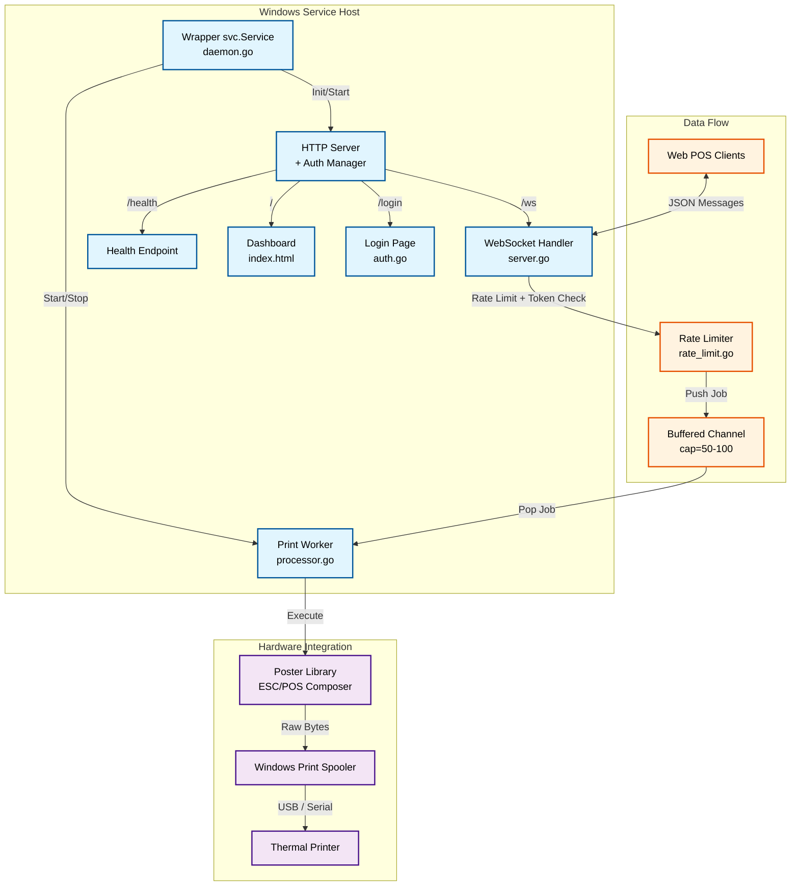
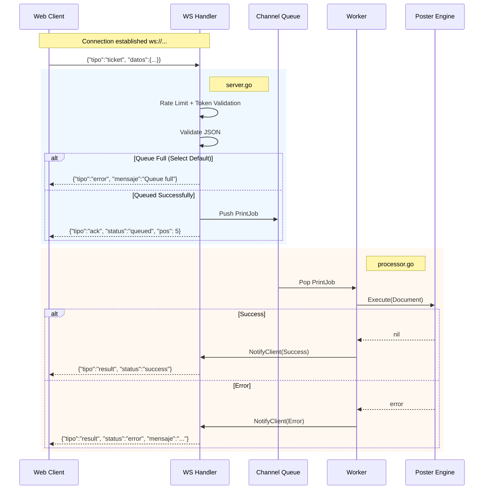

# 🎫 Ticket Daemon

**A production-grade Windows Service that bridges web POS applications with thermal printers via WebSocket.**

<!--  -->

[](https://github.com/adcondev/ticket-daemon/actions/workflows/ci.yml)
[](https://codecov.io/gh/adcondev/ticket-daemon)
[](https://goreportcard.com/report/github.com/adcondev/ticket-daemon)


Ticket Daemon is a Windows Service designed for production retail environments. It acts as a robust middleware that
connects Web POS applications with physical thermal printers via WebSocket. The service manages concurrency from
multiple terminals, queues jobs to guarantee print order, and uses the **Poster** library as the ESC/POS rendering
engine.

---

## ✨ Features

- 🔌 **WebSocket Server** — High-performance bidirectional communication on port 8766
- 🛡️ **Backpressure Protection** — Buffered queue (50–100 slots) with immediate rejection on saturation
- 🖨️ **Native Windows Service** — Full integration with Service Control Manager (SCM)
- 📝 **Structured Logging** — Automatic file rotation (5 MB), filtered verbosity, and audit trail
- 🎫 **Poster Engine** — 11 command types: text, image, barcode, QR, table, separator, feed, cut, raw, pulse, beep
- 🔐 **Dual Security** — Bcrypt-based dashboard login with brute-force lockout + per-message token validation + rate
  limiting (30 jobs/min per client)
- 🖥️ **Embedded Dashboard** — Diagnostic HTML/JS UI bundled into the single binary via `go:embed`
- 🔍 **Printer Discovery** — Auto-detection of installed printers via Windows API with thermal vs. virtual classification

---

## 🏗️ Architecture

### System Components



### Message Lifecycle



---

## 📡 WebSocket Protocol

### Endpoints

| Endpoint                       | Description          |
|--------------------------------|----------------------|
| `ws://localhost:8766/ws`       | WebSocket connection |
| `http://localhost:8766/health` | Health check (JSON)  |
| `http://localhost:8766/`       | Diagnostic dashboard |
| `http://localhost:8766/login`  | Dashboard login      |

### Message Types

| Direction | `tipo`         | Description                       |
|-----------|----------------|-----------------------------------|
| C → S     | `ticket`       | Submit print job (+ `auth_token`) |
| C → S     | `status`       | Query queue status                |
| C → S     | `ping`         | Ping server                       |
| C → S     | `get_printers` | List installed printers           |
| S → C     | `info`         | Welcome / info messages           |
| S → C     | `ack`          | Job accepted and queued           |
| S → C     | `result`       | Job completed or failed           |
| S → C     | `error`        | Validation / queue error          |
| S → C     | `pong`         | Ping response                     |
| S → C     | `printers`     | Printer list response             |

### Example Payload

```json
{
  "tipo": "ticket",
  "id": "pos1-20260115-001",
  "auth_token": "your-secret-token",
  "datos": {
    "version": "1.0",
    "profile": {
      "model": "80mm EC-PM-80250",
      "paper_width": 80
    },
    "commands": [
      {
        "type": "text",
        "data": {
          "content": {
            "text": "TEST TICKET",
            "align": "center",
            "content_style": { "bold": true, "size": "2x2" }
          }
        }
      },
      { "type": "cut", "data": { "mode": "partial" } }
    ]
  }
}
```

---

## 🔐 Security (Build-Time Configuration)

Credentials are injected at compile time via `-ldflags` — no runtime config files needed for secrets.

| Variable           | Description                               | Example                              |
|--------------------|-------------------------------------------|--------------------------------------|
| `AuthToken`        | Token for WebSocket job submissions       | `"my-secret-token"`                  |
| `PasswordHashB64`  | Bcrypt hash (base64) for dashboard login  | `"JDJhJDEwJEx6..."` (generate yours) |
| `BuildEnvironment` | Environment profile (`local` or `remote`) | `"local"` or `"remote"`              |
| `ServiceName`      | Windows service name                      | `"R2k_TicketServicio"`               |

---

## 🚀 Getting Started

### Prerequisites

- **Go 1.24+** — [Download](https://go.dev/dl/)
- **Task (go-task)** — [Installation](https://taskfile.dev/installation/)
- **Windows 10/11** or Windows Server
- A thermal POS printer installed in Windows

### Installation

```powershell
# Clone the repository
git clone https://github.com/adcondev/ticket-daemon.git
cd ticket-daemon

# Clone the Poster library (sibling directory)
git clone https://github.com/adcondev/poster.git ../poster

# Copy and configure environment variables
copy .env.example .env
# Edit .env with your token and password hash
```

### Usage

```powershell
# Build the service binary
task build

# Build and run immediately in console mode
task run

# Clean build artifacts
task clean
```

The service starts on `http://localhost:8766` by default.  
Open the dashboard at `http://localhost:8766/` and the WebSocket at `ws://localhost:8766/ws`.

### Manual Build (without Task)

```powershell
go build -ldflags "-s -w
  -X 'github.com/adcondev/ticket-daemon/internal/config.AuthToken=your-token'
  -X 'github.com/adcondev/ticket-daemon/internal/config.PasswordHashB64=YOUR_HASH'
  -X 'github.com/adcondev/ticket-daemon/internal/config.BuildEnvironment=local'
  -X 'github.com/adcondev/ticket-daemon/internal/config.ServiceName=R2k_TicketServicio'" `
  -o bin/TicketServicio.exe ./cmd/TicketServicio

# Run in console mode
.\bin\TicketServicio.exe -console
```

---

## 📂 Project Structure

```
ticket-daemon/
├── .github/
│   ├── workflows/
│   │   ├── ci.yml                # CI pipeline (test, lint, build, benchmarks)
│   │   ├── codeql.yml            # CodeQL security analysis (SAST)
│   │   ├── pr-automation.yml     # Auto-labeling, conflict detection, auto-assign
│   │   └── pr-status-check.yml   # Weekly PR status dashboard
│   ├── codeql-config.yml         # CodeQL query configuration
│   └── pull_request_template.md  # PR template
│
├── api/
│   └── v1/
│       ├── TICKET_DOCUMENT_V1.md       # Document format specification
│       ├── TICKET_WEBSOCKET_V1.md      # WebSocket protocol specification
│       ├── ticket_document.schema.json # JSON Schema (document)
│       └── ticket_websocket.schema.json# JSON Schema (WebSocket messages)
│
├── cmd/
│   └── TicketServicio/
│       └── main.go               # Entry point (service + console mode)
│
├── internal/
│   ├── assets/
│   │   └── web/                  # Embedded dashboard (HTML/CSS/JS)
│   │       ├── index.html        # Dashboard (Go template with token injection)
│   │       ├── login.html        # Login page
│   │       ├── css/dashboard.css
│   │       └── js/               # config.js, main.js, state.js, ui.js, websocket.js
│   │
│   ├── auth/
│   │   └── auth.go               # Session management, bcrypt login, brute-force protection
│   │
│   ├── config/
│   │   └── config.go             # Environment config, ldflags variables
│   │
│   ├── daemon/
│   │   ├── daemon.go             # svc.Service wrapper, HTTP mux, route setup
│   │   ├── daemon_types.go       # HealthResponse, QueueStatus, WorkerStatus types
│   │   ├── logger.go             # Filtered logging with 5 MB rotation
│   │   └── printer_discovery.go  # Cached printer discovery via Windows API
│   │
│   ├── posprinter/
│   │   └── types.go              # Shared DTOs (PrinterSummary, PrinterDetailDTO)
│   │
│   ├── server/
│   │   ├── server.go             # WebSocket handler, job queue, message routing
│   │   ├── clients.go            # Thread-safe client registry (sync.RWMutex)
│   │   └── rate_limit.go         # Per-client sliding-window rate limiter
│   │
│   └── worker/
│       └── processor.go          # Print job executor, Poster library integration
│
├── embed.go                      # go:embed directive for web assets
├── go.mod / go.sum
├── Taskfile.yml                  # Build automation (build, run, clean)
├── .golangci.yml                 # Linter configuration (16+ linters)
├── .env.example                  # Environment variable template
├── LEARNING.md                   # Technical summary for portfolio/CV
├── README.md
└── LICENSE                       # MIT
```

---

## 📝 Logging & Audit

Logs are written to `%PROGRAMDATA%` and rotate automatically when exceeding 5 MB.

| Environment  | Default Path                                               |
|--------------|------------------------------------------------------------|
| **`remote`** | `C:\ProgramData\R2k_TicketServicio\R2k_TicketServicio.log` |
| **`local`**  | `C:\ProgramData\R2k_TicketServicio\R2k_TicketServicio.log` |

Audit events (login attempts, token rejections, rate limiting) are logged with `[AUDIT]` prefix.

---

## 🔧 Troubleshooting

| Problem                 | Solution                                                                         |
|-------------------------|----------------------------------------------------------------------------------|
| Service won't start     | Check logs at `%PROGRAMDATA%\<ServiceName>\`, verify port 8766 is available      |
| WebSocket won't connect | Verify service is running, check firewall for port 8766, test `/health` endpoint |
| Printer not printing    | Ensure `profile.model` matches the exact Windows printer name, verify Spooler    |
| Dashboard login fails   | Ensure `TICKET_DASHBOARD_HASH` was set at build time, check for IP lockout       |
| Rate limit errors       | Reduce submission frequency (max 30 jobs/min per client)                         |

---

## 📖 API Documentation

| Document                                                                    | Description                         |
|-----------------------------------------------------------------------------|-------------------------------------|
| [TICKET_DOCUMENT_V1.md](../poster/api/v1/TICKET_DOCUMENT_V1.md)             | Print document format specification |
| [TICKET_WEBSOCKET_V1.md](api/v1/TICKET_WEBSOCKET_V1.md)                     | WebSocket protocol specification    |
| [ticket_document.schema.json](../poster/api/v1/ticket_document.schema.json) | JSON Schema for document validation |
| [ticket_websocket.schema.json](api/v1/ticket_websocket.schema.json)         | JSON Schema for WebSocket messages  |

---

## 🤝 Contributing

Contributions are welcome! Please follow these guidelines:

1. Fork the repository and create a feature branch
2. PR titles must follow [Conventional Commits](https://www.conventionalcommits.org/) format (e.g.,
   `feat(server): add new endpoint`)
3. All PRs require passing CI checks (tests, lint, build)
4. Fill out the PR template provided

---

## 📄 License

MIT © Adrián Constante

---

## 🔗 Related Resources

- [Poster Library](https://github.com/adcondev/poster) — ESC/POS rendering engine
- [Task - Build Automation](https://taskfile.dev/)
